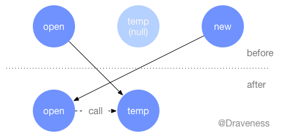
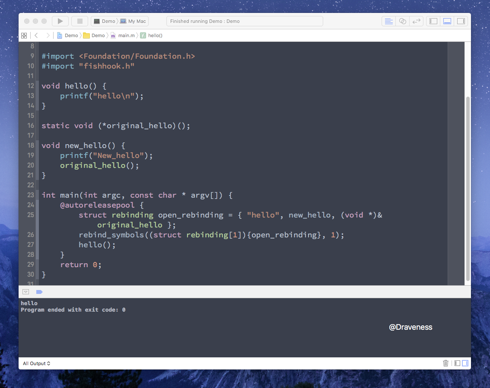
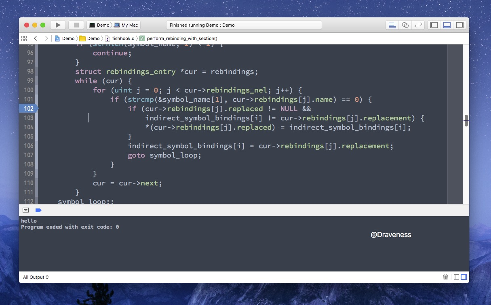

# 动态修改 C 语言函数的实现

Objective-C 作为基于 Runtime 的语言，它有非常强大的动态特性，可以在运行期间自省、进行方法调剂、为类增加属性、修改消息转发链路，在代码运行期间通过 Runtime 几乎可以修改 Objecitve-C 层的一切类、方法以及属性。

> 真正绝对意义上的动态语言或者静态语言是不存在的。

C 语言往往会给我们留下**不可修改**的这一印象；在之前的几年时间里，笔者确实也是这么认为的，然而最近接触到的 [fishhook](https://github.com/facebook/fishhook) 使我对 **C 语言的不可修改**有了更加深刻的理解。

> 在文章中涉及到一个比较重要的概念，就是镜像（image）；在 Mach-O 文件系统中，所有的可执行文件、dylib 以及 Bundle 都是镜像。

## fishhook 简介

到这里，我们该简单介绍一下今天分享的 fishhook；fishhook 是一个由 facebook 开源的第三方框架，其主要作用就是**动态修改 C 语言函数实现**。

这个框架的代码其实非常的简单，只包含两个文件：`fishhook.c` 以及 `fishhook.h`；两个文件所有的代码加起来也不超过 300 行。

不过它的实现原理是非常有意思并且精妙的，我们可以从 `fishhook` 提供的接口中入手。

## 从接口开始

fishhook 提供非常简单的两个接口以及一个结构体：

```c
struct rebinding {
	const char *name;
	void *replacement;
	void **replaced;
};

int rebind_symbols(struct rebinding rebindings[], size_t rebindings_nel);

int rebind_symbols_image(void *header,
						 intptr_t slide,
						 struct rebinding rebindings[],
						 size_t rebindings_nel);
```

其中 `rebind_symbols` 接收一个 `rebindings` 数组，也就是重新绑定信息，还有就是 `rebindings_nel`，也就是 `rebindings` 的个数。

## 使用 fishhook 修改 C 函数

使用 fishhook 修改 C 函数很容易，我们使用它提供的几个范例来介绍它的使用方法。

这里要修改的是底层的 `open` 函数的实现，首先在工程中引入 `fishhook.h` 头文件，然后声明一个与原函数签名相同的函数指针：

```c
#import "fishhook.h"

static int (*origianl_open)(const char *, int, ...);
```

然后重新实现 `new_open` 函数：

```c
int new_open(const char *path, int oflag, ...) {
	va_list ap = {0};
	mode_t mode = 0;

	if ((oflag & O_CREAT) != 0) {
		// mode only applies to O_CREAT
		va_start(ap, oflag);
		mode = va_arg(ap, int);
		va_end(ap);
		printf("Calling real open('%s', %d, %d)\n", path, oflag, mode);
		return orig_open(path, oflag, mode);
	} else {
		printf("Calling real open('%s', %d)\n", path, oflag);
		return orig_open(path, oflag, mode);
	}
}
```

这里调用的 `original_open` 其实相当于执行原 `open`；最后，在 main 函数中使用 `rebind_symbols` 对符号进行重绑定：

```c
// 初始化一个 rebinding 结构体
struct rebinding open_rebinding = { "open", new_open, (void *)&original_open };

// 将结构体包装成数组，并传入数组的大小，对原符号 open 进行重绑定
rebind_symbols((struct rebinding[1]){open_rebinding}, 1);

// 调用 open 函数
__unused int fd = open(argv[0], O_RDONLY); 
```

在对符号进行重绑定之后，所有调用 `open` 函数的地方实际上都会执行 `new_open` 的实现，也就完成了对 `open` 的修改。


程序运行之后打印了 `Calling real open('/Users/apple/Library/Developer/Xcode/DerivedData/Demo-cdnoozusghmqtubdnbzedzdwaagp/Build/Products/Debug/Demo', 0)` 说明我们的对 `open` 函数的修改达到了预期的效果。

> 整个 main.m 文件中的代码在文章的最后面 [main.m](#main.m) 

## fishhook 的原理以及实现

在介绍 fishhook 具体实现原理之前，有几个非常重要的知识需要我们了解，那就是 **dyld**、动态链接以及 Mach-O 文件系统。

### dyld 与动态链接

dyld 是 the dynamic link editor 的缩写~~（笔者并不知道为什么要这么缩写）~~。至于它的作用，简单一点说，就是负责将各种各样程序需要的**镜像**加载到程序运行的内存空间中，**这个过程发生的时间非常早 --- 在 objc 运行时初始化之前**。

在 dyld 加载镜像时，会执行注册过的回调函数；当然，我们也可以使用下面的方法注册自定义的回调函数，**同时也会为所有已经加载的镜像执行回调**：

```c
extern void _dyld_register_func_for_add_image(
	void (*func)(const struct mach_header* mh, intptr_t vmaddr_slide)
);
```

对于每一个已经存在的镜像，当它被**动态链接**时，都会执行回调 `void (*func)(const struct mach_header* mh, intptr_t vmaddr_slide)`，传入文件的 `mach_header` 以及一个虚拟内存地址 `intptr_t`。

以一个最简单的 Hello World 程序为例：

```c
#include <stdio.h>

int main(int argc, const char * argv[]) {
	printf("Hello, World!\n");
	return 0;
}
```

代码中只引用了一个 `stdio` 库中的函数 `printf`；我们如果 Build 这段代码，生成可执行文件之后，使用下面的命令 `nm`：

```shell
$ nm -nm HelloWorld
```

`nm` 命令可以查看可执行文件中的符号（对 `nm` 不熟悉的读者可以在终端中使用 `man nm` 查看手册）：

```c
				 (undefined) external _printf (from libSystem)
				 (undefined) external dyld_stub_binder (from libSystem)
0000000100000000 (__TEXT,__text) [referenced dynamically] external __mh_execute_header
0000000100000f50 (__TEXT,__text) external _main
```

在可执行文件中的符号列表中，`_printf` 这个符号是未定义（undefined）的，换句话说，编译器还不知道这个符号对应什么东西。

但是，如果在文件中加入一个 C 函数 `hello_world`：

```c
#include <stdio.h>

void hello_world() {
	printf("Hello, World!\n");
}

int main(int argc, const char * argv[]) {
	printf("Hello, World!\n");
	return 0;
}
```

在构建之后，同样使用 `nm` 查看其中的符号：

```c
				 (undefined) external _printf (from libSystem)
				 (undefined) external dyld_stub_binder (from libSystem)
0000000100000000 (__TEXT,__text) [referenced dynamically] external __mh_execute_header
0000000100000f30 (__TEXT,__text) external _hello_world
0000000100000f50 (__TEXT,__text) external _main
```

我们的符号 `_hello_world` 并不是未定义的（undefined），它包含一个内存地址以及 `__TEXT` 段。也就是说**手写的一些函数，在编译之后，其地址并不是未定义的**，这一点对于之后分析 fishhook 有所帮助。

使用 `nm` 打印出的另一个符号 `dyld_stub_binder` 对应另一个同名函数。`dyld_stub_binder` 会在目标符号（例如 `printf`）被调用时，将其链接到指定的动态链接库 `libSystem`，再执行 `printf` 的实现（`printf` 符号位于 `__DATA` 端中的 lazy 符号表中）：


每一个镜像中的 `__DATA` 端都包含两个与动态链接有关的表，其中一个是 `__nl_symbol_ptr`，另一个是 `__la_symbol_ptr`：

+ `__nl_symbol_ptr` 中的 non-lazy 符号是在动态链接库绑定的时候进行加载的
+ `__la_symbol_ptr` 中的符号会在该符号被第一次调用时，通过 dyld 中的 `dyld_stub_binder` 过程来进行加载

```c
0000000100001010    dq  0x0000000100000f9c  ; XREF=0x1000002f8, imp___stubs__printf
```

地址 `0x0000000100000f9c` 就是 `printf` 函数打印字符串实现的位置：


在上述代码调用 `printf` 时，由于符号是没有被加载的，就会通过 `dyld_stub_binder` 动态绑定符号。

### Mach-O

由于文章中会涉及一些关于 Mach-O 文件格式的知识，所以在这里会简单介绍一下 Mach-O 文件格式的结构。

每一个 Mach-O 文件都会被分为不同的 Segments，比如 `__TEXT`, `__DATA`, `__LINKEDIT`：


这也就是 Mach-O 中的 `segment_command`（32 位与 64 位不同）：

```c
struct segment_command_64 { /* for 64-bit architectures */
	uint32_t	cmd;		/* LC_SEGMENT_64 */
	uint32_t	cmdsize;	/* includes sizeof section_64 structs */
	char		segname[16];	/* segment name */
	uint64_t	vmaddr;		/* memory address of this segment */
	uint64_t	vmsize;		/* memory size of this segment */
	uint64_t	fileoff;	/* file offset of this segment */
	uint64_t	filesize;	/* amount to map from the file */
	vm_prot_t	maxprot;	/* maximum VM protection */
	vm_prot_t	initprot;	/* initial VM protection */
	uint32_t	nsects;		/* number of sections in segment */
	uint32_t	flags;		/* flags */
};
```

而每一个 `segment_command` 中又包含了不同的 `section`：

```c
struct section_64 { /* for 64-bit architectures */
	char		sectname[16];	/* name of this section */
	char		segname[16];	/* segment this section goes in */
	uint64_t	addr;		/* memory address of this section */
	uint64_t	size;		/* size in bytes of this section */
	uint32_t	offset;		/* file offset of this section */
	uint32_t	align;		/* section alignment (power of 2) */
	uint32_t	reloff;		/* file offset of relocation entries */
	uint32_t	nreloc;		/* number of relocation entries */
	uint32_t	flags;		/* flags (section type and attributes)*/
	uint32_t	reserved1;	/* reserved (for offset or index) */
	uint32_t	reserved2;	/* reserved (for count or sizeof) */
	uint32_t	reserved3;	/* reserved */
};
```

你只需要对这几个概念有一个简单的了解，知道它们有怎样的包含关系，当文章中挑出这个名字时，对它不是一无所知就足够了，这里并不会涉及太多相关的知识。

### fishhook 的原理

到目前为止，我们对 dyld 以及 Mach-O 有了一个初步的了解，而 fishhook 使用了前面章节提到的 `_dyld_register_func_for_add_image` 注册了一个回调，在每次加载镜像到程序中执行回调，动态修改 C 函数实现。

在具体分析其源代码之前，先为各位读者详细地介绍它的实现原理：

dyld 通过更新 Mach-O 二进制文件 `__DATA` 段中的一些指针来绑定 lazy 和 non-lazy 的符号；而 fishhook 先确定某一个符号在 `__DATA` 段中的位置，然后**保存原符号对应的函数指针，并使用新的函数指针覆盖原有符号的函数指针**，实现重绑定。

整个过程可以用这么一张图来表示：




原理看起来还是很简单的，其中最复杂的部分就是从二进制文件中寻找某个符号的位置，在 fishhook 的 README 中，有这样一张图：


这张图初看很复杂，不过它演示的是寻找符号的过程，我们根据这张图来分析一下这个过程：

1. 从 `__DATA` 段中的 lazy 符号指针表中查找某个符号，获得这个符号的偏移量 `1061`，然后在每一个 `section_64` 中查找 `reserved1`，通过这两个值找到 Indirect Symbol Table 中符号对应的条目
2. 在 Indirect Symbol Table 找到符号表指针以及对应的索引 `16343` 之后，就需要访问符号表
3. 然后通过符号表中的偏移量，获取字符串表中的符号 `_close`

### fishhook 的实现

上面梳理了寻找符号的过程，现在，我们终于要开始分析 fishhook 的源代码，看它是如何一步一步替换原有函数实现的。

对实现的分析会 `rebind_symbols` 函数为入口，首先看一下函数的调用栈：

```c
int rebind_symbols(struct rebinding rebindings[], size_t rebindings_nel);
└── extern void _dyld_register_func_for_add_image(void (*func)(const struct mach_header* mh, intptr_t vmaddr_slide));

static void _rebind_symbols_for_image(const struct mach_header *header, intptr_t slide)
└── static void rebind_symbols_for_image(struct rebindings_entry *rebindings, const struct mach_header *header, intptr_t slide)
	└── static void perform_rebinding_with_section(struct rebindings_entry *rebindings, section_t *section, intptr_t slide, nlist_t *symtab, char *strtab, uint32_t *indirect_symtab)
```

其实函数调用栈非常简单，因为整个库中也没有几个函数，`rebind_symbols` 作为接口，其主要作用就是注册一个函数并在镜像加载时回调：

```c
int rebind_symbols(struct rebinding rebindings[], size_t rebindings_nel) {
	int retval = prepend_rebindings(&_rebindings_head, rebindings, rebindings_nel);
	if (retval < 0) return retval;

	if (!_rebindings_head->next) {
		_dyld_register_func_for_add_image(_rebind_symbols_for_image);
	} else {
		uint32_t c = _dyld_image_count();
		for (uint32_t i = 0; i < c; i++) {
			_rebind_symbols_for_image(_dyld_get_image_header(i), _dyld_get_image_vmaddr_slide(i));
		}
	}
	return retval;
}
```

在 `rebind_symbols` 最开始执行时，会先调用一个 `prepend_rebindings` 的函数，将整个 `rebindings` 数组添加到 `_rebindings_head` 这个私有数据结构的头部：

```c
static int prepend_rebindings(struct rebindings_entry **rebindings_head,
							  struct rebinding rebindings[],
							  size_t nel) {
	struct rebindings_entry *new_entry = malloc(sizeof(struct rebindings_entry));
	if (!new_entry) {
		return -1;
	}
	new_entry->rebindings = malloc(sizeof(struct rebinding) * nel);
	if (!new_entry->rebindings) {
		free(new_entry);
		return -1;
	}
	memcpy(new_entry->rebindings, rebindings, sizeof(struct rebinding) * nel);
	new_entry->rebindings_nel = nel;
	new_entry->next = *rebindings_head;
	*rebindings_head = new_entry;
	return 0;
}
```

也就是说每次调用的 `rebind_symbols` 方法传入的 `rebindings` 数组以及数组的长度都会以 `rebindings_entry` 的形式添加到 `_rebindings_head` 这个私有链表的首部：

```c
struct rebindings_entry {
	struct rebinding *rebindings;
	size_t rebindings_nel;
	struct rebindings_entry *next;
};

static struct rebindings_entry *_rebindings_head;
```

这样可以通过判断 `_rebindings_head->next` 的值来判断是否为第一次调用，然后使用 `_dyld_register_func_for_add_image` 将 `_rebind_symbols_for_image` 注册为回调或者为所有存在的镜像单独调用 `_rebind_symbols_for_image`：

```c
static void _rebind_symbols_for_image(const struct mach_header *header, intptr_t slide) {
	rebind_symbols_for_image(_rebindings_head, header, slide);
}
```

`_rebind_symbols_for_image` 只是对另一个名字非常相似的函数 `rebind_symbols_for_image` 的封装，从这个函数开始，就到了重绑定符号的过程；不过由于这个方法的实现比较长，具体分析会分成三个部分并省略一些不影响理解的代码：

```c
static void rebind_symbols_for_image(struct rebindings_entry *rebindings,
									 const struct mach_header *header,
									 intptr_t slide) {
	segment_command_t *cur_seg_cmd;
	segment_command_t *linkedit_segment = NULL;
	struct symtab_command* symtab_cmd = NULL;
	struct dysymtab_command* dysymtab_cmd = NULL;

	uintptr_t cur = (uintptr_t)header + sizeof(mach_header_t);
	for (uint i = 0; i < header->ncmds; i++, cur += cur_seg_cmd->cmdsize) {
		cur_seg_cmd = (segment_command_t *)cur;
		if (cur_seg_cmd->cmd == LC_SEGMENT_ARCH_DEPENDENT) {
			if (strcmp(cur_seg_cmd->segname, SEG_LINKEDIT) == 0) {
				linkedit_segment = cur_seg_cmd;
			}
		} else if (cur_seg_cmd->cmd == LC_SYMTAB) {
			symtab_cmd = (struct symtab_command*)cur_seg_cmd;
		} else if (cur_seg_cmd->cmd == LC_DYSYMTAB) {
			dysymtab_cmd = (struct dysymtab_command*)cur_seg_cmd;
		}
	}

	...
}
```

这部分的代码主要功能是从镜像中查找 `linkedit_segment` `symtab_command` 和 `dysymtab_command`；在开始查找之前，要先跳过 `mach_header_t` 长度的位置，然后将当前指针强转成 `segment_command_t`，通过对比 `cmd` 的值，来找到需要的 `segment_command_t`。

在查找了几个关键的 segment 之后，我们可以根据几个 segment 获取对应表的内存地址：

```c
static void rebind_symbols_for_image(struct rebindings_entry *rebindings, const struct mach_header *header, intptr_t slide) {
	...

	uintptr_t linkedit_base = (uintptr_t)slide + linkedit_segment->vmaddr - linkedit_segment->fileoff;
	nlist_t *symtab = (nlist_t *)(linkedit_base + symtab_cmd->symoff);
	char *strtab = (char *)(linkedit_base + symtab_cmd->stroff);

	uint32_t *indirect_symtab = (uint32_t *)(linkedit_base + dysymtab_cmd->indirectsymoff);
	
	...
}
```

在 `linkedit_segment` 结构体中获得其虚拟地址以及文件偏移量，然后通过一下公式来计算当前 `__LINKEDIT` 段的位置：

```
slide + vmaffr - fileoff
```

类似地，在 `symtab_command` 中获取符号表偏移量和字符串表偏移量，从 `dysymtab_command` 中获取间接符号表（indirect symbol table）偏移量，就能够获得_符号表_、_字符串表_以及_间接符号表_的引用了。

+ 间接符号表中的元素都是 `uint32_t *`，指针的值是对应条目 `n_list` 在符号表中的位置
+ 符号表中的元素都是 `nlist_t` 结构体，其中包含了当前符号在字符串表中的下标

	```c
	struct nlist_64 {
		union {
			uint32_t  n_strx; /* index into the string table */
		} n_un;
		uint8_t n_type;        /* type flag, see below */
		uint8_t n_sect;        /* section number or NO_SECT */
		uint16_t n_desc;       /* see <mach-o/stab.h> */
		uint64_t n_value;      /* value of this symbol (or stab offset) */
	};
	```

+ 字符串表中的元素是 `char` 字符

该函数的最后一部分就开启了遍历模式，查找整个镜像中的 `SECTION_TYPE` 为 `S_LAZY_SYMBOL_POINTERS` 或者 `S_NON_LAZY_SYMBOL_POINTERS` 的 section，然后调用下一个函数 `perform_rebinding_with_section` 来对 section 中的符号进行处理：

```c
static void perform_rebinding_with_section(struct rebindings_entry *rebindings, section_t *section, intptr_t slide, nlist_t *symtab, char *strtab, uint32_t *indirect_symtab) {
	uint32_t *indirect_symbol_indices = indirect_symtab + section->reserved1;
	void **indirect_symbol_bindings = (void **)((uintptr_t)slide + section->addr);
	for (uint i = 0; i < section->size / sizeof(void *); i++) {
		uint32_t symtab_index = indirect_symbol_indices[i];
		uint32_t strtab_offset = symtab[symtab_index].n_un.n_strx;
		char *symbol_name = strtab + strtab_offset;

		struct rebindings_entry *cur = rebindings;
		while (cur) {
			for (uint j = 0; j < cur->rebindings_nel; j++) {
				if (strcmp(&symbol_name[1], cur->rebindings[j].name) == 0) {
					if (cur->rebindings[j].replaced != NULL &&
						indirect_symbol_bindings[i] != cur->rebindings[j].replacement) {
						*(cur->rebindings[j].replaced) = indirect_symbol_bindings[i];
					}
					indirect_symbol_bindings[i] = cur->rebindings[j].replacement;
					goto symbol_loop;
				}
			}
			cur = cur->next;
		}
	symbol_loop:;
	}
}
```

该函数的实现的核心内容就是将符号表中的 `symbol_name` 与 `rebinding` 中的名字 `name` 进行比较，如果出现了匹配，就会将原函数的实现传入 `origian_open` 函数指针的地址，并使用新的函数实现 `new_open` 代替原实现：

```c
if (cur->rebindings[j].replaced != NULL &&
	indirect_symbol_bindings[i] != cur->rebindings[j].replacement) {
	*(cur->rebindings[j].replaced) = indirect_symbol_bindings[i]; // 将原函数的实现传入 original_open 函数指针的地址
}
indirect_symbol_bindings[i] = cur->rebindings[j].replacement; // 使用新的函数实现 new_open 替换原实现
```

如果你理解了上面的实现代码，该函数的其它代码就很好理解了：

1. 通过 `indirect_symtab + section->reserved1` 获取 `indirect_symbol_indices *`，也就是符号表的数组
2. 通过 `(void **)((uintptr_t)slide + section->addr)` 获取函数指针列表 `indirect_symbol_bindings`
3. 遍历符号表数组 `indirect_symbol_indices *` 中的所有符号表中，获取其中的符号表索引 `symtab_index`
4. 通过符号表索引 `symtab_index` 获取符号表中某一个 `n_list` 结构体，得到字符串表中的索引 `symtab[symtab_index].n_un.n_strx`
5. 最后在字符串表中获得符号的名字 `char *symbol_name`

到这里比较前的准备工作就完成了，剩下的代码会遍历整个 `rebindings_entry` 数组，在其中查找匹配的符号，完成函数实现的替换：

```c
while (cur) {
	for (uint j = 0; j < cur->rebindings_nel; j++) {
		if (strcmp(&symbol_name[1], cur->rebindings[j].name) == 0) {
			if (cur->rebindings[j].replaced != NULL &&
				indirect_symbol_bindings[i] != cur->rebindings[j].replacement) {
				*(cur->rebindings[j].replaced) = indirect_symbol_bindings[i];
			}
			indirect_symbol_bindings[i] = cur->rebindings[j].replacement;
			goto symbol_loop;
		}
	}
	cur = cur->next;
}
```

在之后对某一函数的调用（例如 `open`），当查找其函数实现时，都会查找到 `new_open` 的函数指针；在 `new_open` 调用 `origianl_open` 时，同样也会执行原有的函数实现，因为我们通过 `*(cur->rebindings[j].replaced) = indirect_symbol_bindings[i]` 将原函数实现绑定到了新的函数指针上。

## 实验

fishhook 在 `dyld` 加载镜像时，插入了一个回调函数，交换了原有函数的实现；但是 fishhook 能否修改非动态链接库，比如开发人员自己手写的函数呢？我们可以做一个非常简单的小实验，下面是我们的 `main.m` 文件：

```c
#import <Foundation/Foundation.h>
#import "fishhook.h"

void hello() {
	printf("hello\n");
}

static void (*original_hello)();

void new_hello() {
	printf("New_hello\n");
	original_hello();
}

int main(int argc, const char * argv[]) {
	@autoreleasepool {
		struct rebinding open_rebinding = { "hello", new_hello, (void *)&original_hello };
		rebind_symbols((struct rebinding[1]){open_rebinding}, 1);
		hello();
	}
	return 0;
}
```

这里的函数实现非常的简单，相信也不需要笔者过多解释了，我们直接运行这份代码：



代码中只打印了 `hello`，说明 fishhook 对这种手写的函数是没有作用的，如果在下面这里打一个断点：



代码并不会进这里，因为 `hello` 这个函数是包含在当前镜像的，它只是从其它代码地址跳转到了当前函数实现，这与我们调用外部库时有很大的不同，当调用外部库时，我们需要 dyld 解决函数地址的问题，但是函数在当前镜像中却并不需要 [issue #25](https://github.com/facebook/fishhook/issues/25)。

## 小结

fishhook 的实现非常的巧妙，但是它的使用也有一定的局限性，在接触到 fishhook 之前，从没有想到过可以通过一种方式修改 C 函数的实现。

## Reference

+ [Mach-O 可执行文件](https://objccn.io/issue-6-3/)
+ [Static linking vs dynamic linking](http://stackoverflow.com/questions/1993390/static-linking-vs-dynamic-linking)

## 其它

### main.m

```c
#import <Foundation/Foundation.h>

#import "fishhook.h"

static int (*original_open)(const char *, int, ...);

int new_open(const char *path, int oflag, ...) {
	va_list ap = {0};
	mode_t mode = 0;

	if ((oflag & O_CREAT) != 0) {
		// mode only applies to O_CREAT
		va_start(ap, oflag);
		mode = va_arg(ap, int);
		va_end(ap);
		printf("Calling real open('%s', %d, %d)\n", path, oflag, mode);
		return original_open(path, oflag, mode);
	} else {
		printf("Calling real open('%s', %d)\n", path, oflag);
		return original_open(path, oflag, mode);
	}
}

int main(int argc, const char * argv[]) {
	@autoreleasepool {
		struct rebinding open_rebinding = { "open", new_open, (void *)&original_open };
		rebind_symbols((struct rebinding[1]){open_rebinding}, 1);
		__unused int fd = open(argv[0], O_RDONLY);
	}
	return 0;
}
```

